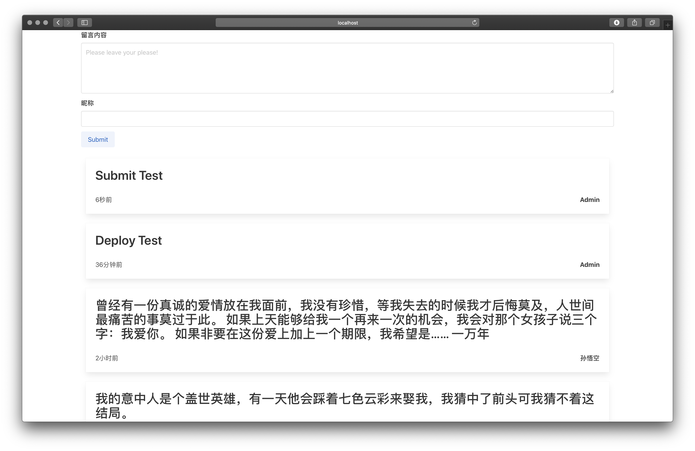

# iBoard

基于 SSM 框架的留言板 功能非常简单

是在学习了SSM这门课的结课作业

Demo
http://veveup.com:81/iboard
http://112.74.183.207:81/iboard
因为服务器内存有限 再运行一个MySql Server后内存不足 所以更换成Sqlite

前端：Html+Bulma.io

框架：Spring SpringMVC MyBatis

支持数据库：Sqlite/Mysql

测试服务器：Tomcat9.0.4




# To-do
 - [ ] 用户系统
 - [ ] 留言编辑修改删除
 - [ ] 点赞 评论系统
 
 
 # QA
 1. 数据库安装正确 密码账号无误的情况下出现数据库连接问题可能的解决方法：
 找了一下资料可能是客户端不支持新的密码加密方法 导致无法连连接
 ```mysql
use mysql;
ALTER USER 'root'@'localhost' IDENTIFIED WITH mysql_native_password BY 'new_password';
flush priviliges;
```


# Log
 2020.07.27 增加sqlite数据库支持 增加时间戳
