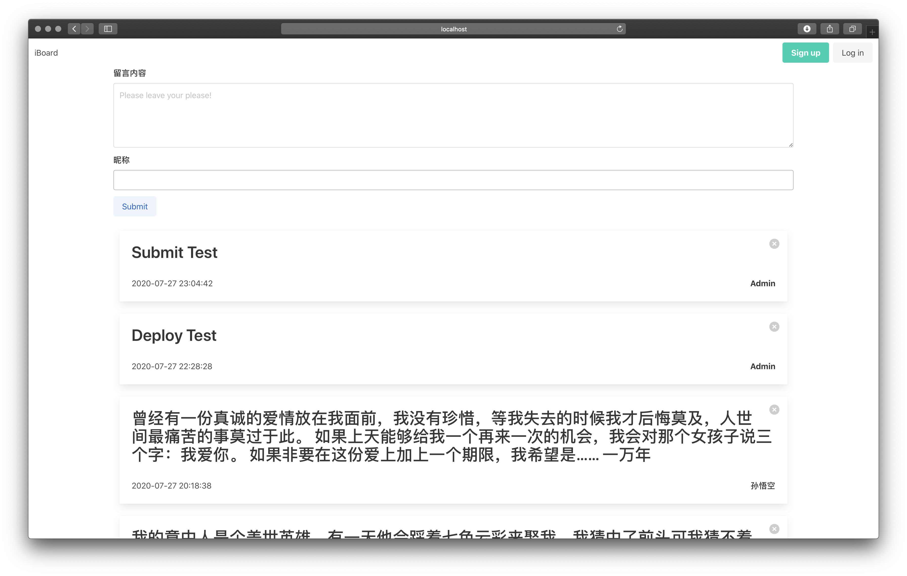
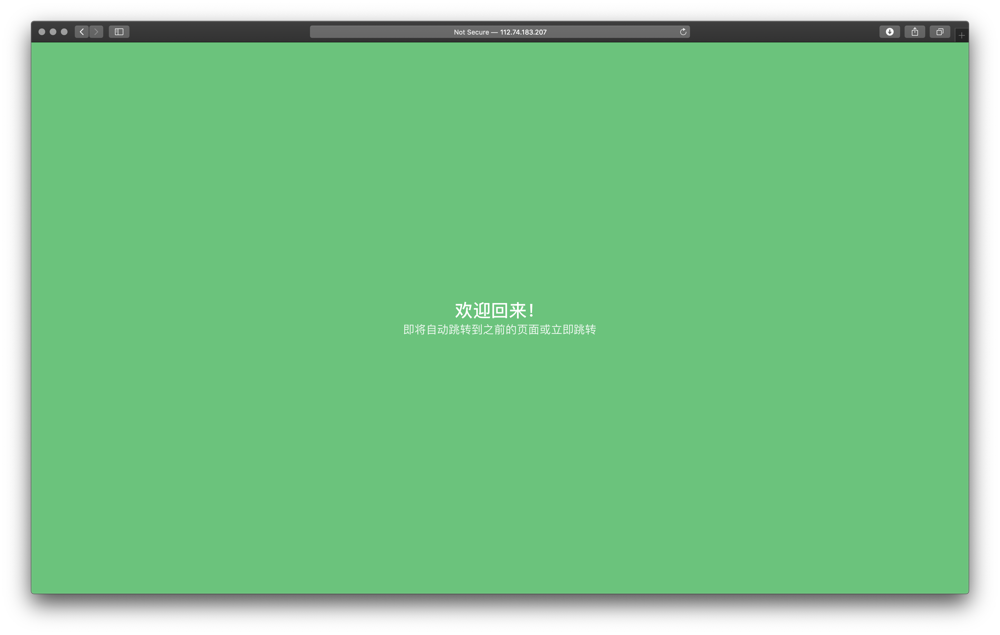

# iBoard

基于 SSM 框架的留言板 功能非常简单 但在持续更新完善中<br>
iBoard是在学习了SSM框架课程的结课作业(已经结课)

Demo
+ http://veveup.com:81/iboard/message/getAll
+ http://112.74.183.207:81/iboard/message/getAll <br>
因为服务器内存有限 再运行一个MySql Server后内存不足 所以更换成Sqlite

前端：Html+Bulma.io<br>
框架：Spring SpringMVC MyBatis<br>
支持数据库：Sqlite/Mysql<br>
测试服务器：Tomcat9.0.4<br>





# To-do
 - [x] 用户系统
    - [ ] 安全优化
    - [ ] 权限管理
 - [ ] 留言修改和删除
    - [x] 删除
    - [ ] 编辑
 - [ ] 点赞 评论系统
 
 
 # QA
 1. 数据库安装正确 密码账号无误的情况下出现数据库连接问题可能的解决方法：<br>
 找了一下资料可能是客户端不支持新的密码加密方法 导致无法连连接
 ```mysql
use mysql;
ALTER USER 'root'@'localhost' IDENTIFIED WITH mysql_native_password BY 'new_password';
flush priviliges;
```


# Log
+ **2020.07.29** 增加留言删除方法 删除按钮
+ **2020.07.28** 仅仅新增用户系统 还没有合并入主要功能
+ **2020.07.27** 增加sqlite数据库支持 增加时间戳
